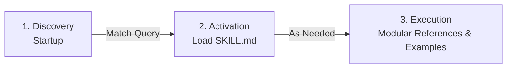

# MapLibre GL JS — Agent Skill 🗺️🤖

[](https://agentskills.io/specification)
[](https://code.claude.com)
[](https://github.com/vercel-labs/skills)
[-brightgreen)](https://maplibre.org/)
[](./LICENSE.md)

> Open-source **MapLibre GL JS** AI skill for coding assistants (Claude Code, Cursor, Antigravity, GitHub Copilot, Windsurf, Roo Code, Gemini CLI). Built in accordance with the open **[Agent Skills Specification](https://agentskills.io/)**.

Maintained by **[MapSnippets](https://mapsnippets.org/)** — Open-source geospatial snippets, guides, and agent tools.

---

🌐 [Website](https://mapsnippets.org/) &nbsp; 📚 [MapLibre GL JS Documentation](https://maplibre.org/maplibre-gl-js/docs/) &nbsp; 📋 [Agent Skills Standard](https://agentskills.io/)

---

<br>

<details>
<summary><b>Table of Contents</b></summary>
<ul>
<li><a href="#-overview--capabilities">Overview & Capabilities</a></li>
<li><a href="#-how-agent-skills-work">How Agent Skills Work</a></li>
<li><a href="#-example-prompts-that-trigger-this-skill">Example Prompts That Trigger This Skill</a></li>
<li><a href="#-installation">Installation</a></li>
<li><a href="#-repository-architecture">Repository Architecture</a></li>
<li><a href="#-quickstart-example">Quickstart Example</a></li>
<li><a href="#-basemap-api-keys">Basemap API Keys</a></li>
<li><a href="#-evaluation--validation">Evaluation & Validation</a></li>
<li><a href="#links">Links</a></li>
<li><a href="#-forking--customization">Forking & Customization</a></li>
<li><a href="#-license">License</a></li>
</ul>
</details>

<br>

## 💡 Overview & Capabilities

An **Agent Skill** is on-demand domain expertise: AI assistants load it dynamically when a task requires specialized geospatial knowledge, replacing guesswork and hallucinated legacy APIs with verified patterns.

When activated for **MapLibre GL JS**, this skill guides the agent to:

- **Generate pure native MapLibre GL JS code** (v6.7.0 ESM / v6+) using modern lifecycle practices (WebGL container sizing, canvas resizing, event delegation, and resource cleanup).
- **Configure high-performance vector basemaps** with modern vector tile styles (`streets-v4`, `outdoor-v4`, `satellite-v4`, `dataviz-v4-dark`, `base-v4`) and clean typography.
- **Author complex data-driven expressions** (`interpolate`, `step`, `match`, `case`, `feature-state`) with strict type safety and zero syntax errors.
- **Handle GeoJSON layers & spatial clustering** — spatial clustering, expansion zoom, unclustered point popups, and high-frequency `setData` mutations.
- **Implement 3D terrain, hillshade & globe projections** — Terrain-RGB raster-dem sources, sky layers, pitch & bearing camera animations, and projection transitions.
- **Full MapTiler ecosystem integration** — High-resolution MapTiler Planet v4 vector basemaps, Terrain-RGB elevation, elevation contours, hillshading, and custom WebGL layers.
- **Prevent common hallucination traps** — eliminates deprecated Mapbox endpoints, fixes coordinate order inversions (`[lng, lat]` vs `[lat, lng]`), and guarantees layers wait for map `load` before injection.

<br>

## 🧠 How Agent Skills Work

This skill follows the **[Agent Skills open format](https://agentskills.io/)**, utilizing a **three-tier progressive disclosure model** to minimize context overhead:



1. **Discovery (Startup)**: The agent only inspects the YAML frontmatter `name` and `description` (~50 tokens).
2. **Activation (Task Identified)**: When your prompt mentions MapLibre, vector tiles, 3D maps, or geospatial styling, the agent loads `skills/maplibre/SKILL.md` (< 2,500 tokens).
3. **Execution (Deep Dive)**: The agent traverses targeted guides in `references/` or runnable recipes in `examples/` on demand, without polluting your context window.

<br>

## 🎯 Example Prompts That Trigger This Skill

You don't need special commands to use this skill. Any natural language request matching its capabilities will trigger it:

- *"Create an interactive map centered on Tokyo with 3D buildings that change color based on height."*
- *"Add a live GeoJSON earthquake feed to my map with cluster circles and popups showing magnitude on click."*
- *"How do I create a satellite map with 3D terrain elevation and contour lines in MapLibre GL JS?"*
- *"Implement a smooth flyTo camera animation between five scenic waypoints in 3D terrain mode."*
- *"Build a split-screen swipe map comparing satellite imagery with a topographic outdoor map."*

<br>

## 📦 Installation

### Option 1: Universal — via Skills CLI (Recommended)

Works across Claude Code, Cursor, Windsurf, Gemini CLI, Antigravity, and dozens of other AI coding tools. The [Skills CLI](https://github.com/vercel-labs/skills) auto-detects your active environments:

```bash
npx skills add mapsnippets/maplibre-skill
```

<br>

### Option 2: Claude Code Plugin

Install directly via the Claude Code plugin marketplace:

```bash
/plugin marketplace add mapsnippets/maplibre-skill
/plugin install maplibre-skill@maplibre-skill
/reload-plugins
```

<br>

### Option 3: Manual Installation by Client

Copy or symlink the `skills/maplibre` directory into your agent's configured skills path:

| Agent / Tool | Target Directory | Install Command |
| :--- | :--- | :--- |
| **Cursor** | `.cursor/skills/maplibre` | `mkdir -p .cursor/skills && cp -r skills/maplibre .cursor/skills/` |
| **VS Code / Copilot** | `.agents/skills/maplibre` | `mkdir -p .agents/skills && cp -r skills/maplibre .agents/skills/` |
| **Gemini CLI / Antigravity** | `~/.gemini/skills/maplibre` | `mkdir -p ~/.gemini/skills && cp -r skills/maplibre ~/.gemini/skills/` |
| **Windsurf (Cascade)** | `.windsurf/skills/maplibre` | `mkdir -p .windsurf/skills && cp -r skills/maplibre .windsurf/skills/` |
| **Roo Code / Cline** | `.roo/skills/maplibre` | `mkdir -p .roo/skills && cp -r skills/maplibre .roo/skills/` |
| **OpenHands** | `.agents/skills/maplibre` | `mkdir -p .agents/skills && cp -r skills/maplibre .agents/skills/` |

<br>

## 📘 Repository Architecture

This repository strictly conforms to the [Agent Skills specification](https://agentskills.io/specification) (`dir_name == name`):

```text
mapsnippets/maplibre-skill/
├── .claude-plugin/
│   ├── marketplace.json    — Claude Code marketplace catalog manifest (v1.1.0)
│   └── plugin.json         — Claude Code plugin manifest & metadata (v1.1.0)
├── skills/
│   └── maplibre/
│       ├── SKILL.md        — Entry point prompt & progressive disclosure router (< 200 lines)
│       ├── evals/
│       │   └── evals.json  — Machine-readable evaluation benchmarks (5 core test cases)
│       ├── examples/       — 41 standalone runnable recipes (HTML/CSS/JS)
│       │   ├── INDEX.md    — Curated categorized catalog of all recipes
│       │   └── ...         — 3D terrain, clustering, satellite hybrid, animations, swipe maps
│       └── references/     — 15 deep technical reference guides & API specifications
│           ├── INDEX.md    — Searchable index of references
│           ├── versions.md — Single source of truth for library releases & styles
│           └── ...         — expressions, layers, events, 3D terrain, Planet v4 vector styling
├── README.md               — Project documentation & setup guide
└── LICENSE.md              — MIT License
```

<br>

## 🗺️ Quickstart Example

```javascript
import maplibregl from "maplibre-gl";
import "maplibre-gl/dist/maplibre-gl.css";

const map = new maplibregl.Map({
  container: "map",
  style: "https://api.maptiler.com/maps/streets-v4/style.json?key=YOUR_API_KEY",
  center: [14.4378, 50.0755], // [longitude, latitude]
  zoom: 12
});

map.on("load", () => {
  map.addControl(new maplibregl.NavigationControl(), "top-right");
});
```

<br>

## 🔑 Basemap API Keys

The vector tile recipes in this skill use MapTiler Planet v4 vector basemap styles. To run recipes with live vector tiles:
- Follow the guide on [how to get a free MapTiler API Key](https://docs.maptiler.com/cloud/api/authentication-key/) (free tier includes 100,000 monthly requests).
- Replace `YOUR_API_KEY` in the snippet with your active key.

<br>

## 🧪 Evaluation & Validation

This skill includes an automated evaluation benchmark suite in `skills/maplibre/evals/evals.json` covering:
1. Interactive 3D Mountain Terrain (DEM elevation, sky horizon, camera pitch)
2. Point Clustering with Dynamic Bubbles (count badges, step styling, zoom expansion)
3. Extruded 3D Urban Buildings (height expressions, 60° camera tilt)
4. Smooth 60 FPS Route Marker Animation (Turf.js interpolation, bearing rotation)
5. Satellite Imagery with 3D Terrain & Contours (photorealistic basemap with elevation)

To validate compliance against the Agent Skills specification using the reference validator:

```bash
npx @agentskills/skills-ref validate skills/maplibre
```

<br>

## Links

- 🌐 [MapSnippets Community](https://mapsnippets.org/)
- 🗺️ [MapLibre GL JS Documentation](https://maplibre.org/maplibre-gl-js/docs/)
- 📋 [Agent Skills Specification](https://agentskills.io/)
- 🐙 [GitHub Repository](https://github.com/mapsnippets/maplibre-skill)

<br>

## 🍴 Forking & Customization

This repository is maintained by [MapSnippets](https://mapsnippets.org/) for automated distribution to AI coding agents. To keep maintenance lightweight and reliable, external pull requests and code contributions are not accepted.

However, you are completely free to fork, customize, and extend this skill for your own private agents, corporate workflows, or specialized mapping tools under the permissive [MIT License](./LICENSE.md).

<br>

## 📄 License

This project is licensed under the MIT License — see the [LICENSE](./LICENSE.md) file for details.

<br>

<p align="center">
  Maintained with ❤️ by <a href="https://mapsnippets.org/">MapSnippets</a> — Open web mapping tools & agent skills.
</p>
